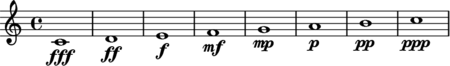
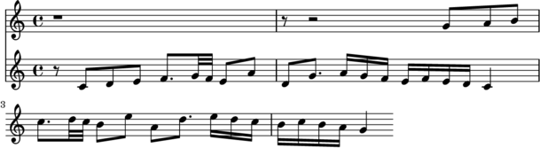
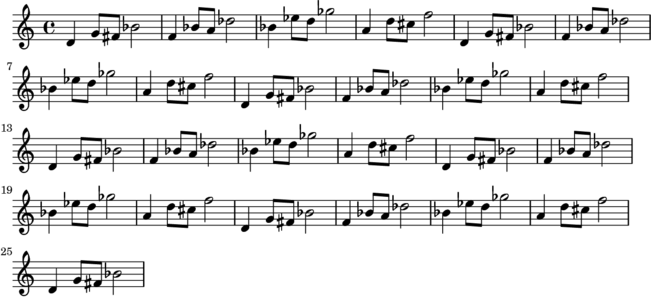

# Getting Started

## Installation

The Music Suite depends on the [Haskell platform][HaskellPlatform].

While not strictly required, [Lilypond][Lilypond] is highly recommended as it allow you to
preview musical scores. See [Import and Export](#import-and-export) for other formats.

To install the suite, simply install the Haskell platform, and then run:

    cabal install music-preludes


## Writing music

This chapter will cover how to use the Music Suite to generate music. Later on we will cover how to *import* and *transform* music.

One of the main points of the Music Suite is to avoid committing to a *single*, closed music representation. Instead it provides a set of types and type constructors that can be used to construct an arbitrary representation of music. 

Usually you will not want to invent a new representation from scratch, but rather start with a standard representation and customize it when needed. The default representation is defined in the `Music.Prelude.Basic` module, which is implicitly imported in all the examples below. See [Customizing the Music Representation](#customizing-music-representation) for other examples.


### With music files

A piece of music is described by a *expressions* such as this one:

```haskell
c |> d |> e

```

The simplest way to render this expression is to save it in a file named
`foo.music` (or similar) and convert it using `music2pdf foo.music`. This
should render a file called `foo.pdf` containing the following:


There are several programs for converting music expressions:

* `music2mid` 
* `music2musicxml` 
* `music2ly` 
* `music2wav` 
* `music2pdf`

### With Haskell files

Alternatively, you can create a file called `test.hs` (or similar) with the following structure:

```haskell
import Music.Prelude.Basic

music = c |> d |> e
main = defaultMain music

```

Then either execute it using:

    $ runhaskell test.hs
    
or compile and run it with

    $ ghc --make test
    $ ./test

However, `music.hs` can also be loaded into a Haskell interpreter or compiled.
In this case the resulting program will generate and open a file called
`test.pdf` containing the output seen above.

In fact, the `music2pdf` program is a simple utility that substitutes a single expression into a Haskell module such as the one above and executes the resulting main function.


## Notes, time and duration

A single note can be entered by its name. This will render a note in the middle octave with a duration of one. Note that note values and durations correspond exactly, a duration of `1` is a whole note, a duration of `1/2` is a half note, and so on.

<div class='haskell-music'>


```haskell
c

```

</div>

To change the duration of a note, use [`stretch`][stretch] or [`compress`][compress]. Note that:
    
```haskell
compress x = stretch (1/x)

```

for all values of *x*.

<div class='haskell-music'>


```haskell
stretch (1/2) c

```

</div>

<div class='haskell-music'>


```haskell
stretch 2 c         

```

</div>

<div class='haskell-music'>


```haskell
stretch (4+1/2) c

```

</div>

TODO delay

Offset and duration is not limited to simple numbers. Here are some more complex examples:

<div class='haskell-music'>


```haskell
c^*(9/8) |> d^*(7/8)

```

</div>

<div class='haskell-music'>


```haskell
stretch (2/3) (scat [c,d,e]) |> f^*(3/2)

```

</div>

The `^*` and `^/` operators can be used as shorthands for `delay` and `compress`.

<div class='haskell-music'>


```haskell
(c |> d |> e |> c |> d^*2 |> d^*2)^/16

```

</div>


Allthough the actual types are more general, you can think of `c` as an expression
of type `Score Note`, and the transformations as functions `Score Note -> Score Note`.

<div class='haskell-music'>


```haskell
up (perfect octave) . compress 2 . delay 3 $ c

```

</div>


## Composing

Music expressions can be composed [`<>`][<>]:

<div class='haskell-music'>


```haskell
c <> e <> g

```

</div>

TODO fundamentally, `<>` is the only way to compose music...

Or in sequence using [`|>`][|>]:

<div class='haskell-music'>


```haskell
c |> d |> e

```

</div>

Or partwise using [`</>`][</>]:

<div class='haskell-music'>


```haskell
c </> e </> g

```

</div>

Here is a more complex example:

<div class='haskell-music'>


```haskell
let            
    scale = scat [c,d,e,f,g,a,g,f]^/8
    triad a = a <> up _M3 a <> up _P5 a
in up _P8 scale </> (triad c)^/2 |> (triad g_)^/2

```

</div>

As a shorthand for `x |> y |> z ..`, we can write `scat [x, y, z]`.
[`scat`][scat] (this is short for *sequential concatenation*).

<div class='haskell-music'>


```haskell
scat [c,e..g]^/4

```

</div>

For `x <> y <> z ..`, we can write `pcat [x, y, z]`.
[`pcat`][pcat] (short for *parallel concatenation*).

<div class='haskell-music'>


```haskell
pcat [c,e..g]^/2

```

</div>


## Pitch

To facilitate the use of non-standard pitch, the standard pitch names are provided as overloaded values, referred to as *pitch literals*. 

To understand how this works, think about the type of numeric literal. The values $0, 1, 2$ etc. have type `Num a => a`, similarly, the pitch literals $c, d, e, f ...$ have type `IsPitch a => a`.

For Western-style pitch types, the standard pitch names can be used:

<div class='haskell-music'>


```haskell
scat [c, d, e, f, g, a, b]

```

</div>

Pitch names in other languages work as well, for example `ut, do, re, mi, fa, so, la, ti, si`. 

<!--
German names (using `h` and `b` instead of `b` and `bb`) can be approximated as follows:

```haskell
import Music.Preludes.Basic hiding (b)
import qualified Music.Pitch.Literal as P

h = P.b
b = P.bb

```
-->


You can change octave using `octavesUp` and `octavesDown`:

<div class='haskell-music'>


```haskell
octavesUp 4 c
    </>
octavesUp (-1) c
    </>
octavesDown 2 c

```

</div>

Shorter syntax for other octaves:

<div class='haskell-music'>


```haskell
c__ |> c_ |> c |> c' |> c''

```

</div>

Sharps and flats can be added by the functions [`sharp`][sharp] and [`flat`][flat], which are written 
*postfix* thanks to some overloading magic.

<div class='haskell-music'>


```haskell
c sharp |> d |> e flat

```

</div>

You can also use the ordinary (prefix) versions `sharpen` and `flatten`.

<div class='haskell-music'>


```haskell
sharpen c 
    </> 
(sharpen . sharpen) c

```

</div>

Shorter syntax for sharp and flat notes:

<div class='haskell-music'>


```haskell
(cs |> ds |> es)    -- sharp
    </>
(cb |> db |> eb)    -- flat

```

</div>

Here is an overview of all pitch notations:

```haskell
sharpen c             == c sharp       == cs
flatten d             == d flat        == ds
(sharpen . sharpen) c == c doubleSharp == css
(flatten . flatten) d == d doubleFlat  == dss

```

Note that there is no guarantee that your pitch representation use enharmonic equivalence, so `cs == db` may or may not hold.

There is nothing special about the pitch and interval literals, they are simply values exported by the `Music.Pitch.Literal` module. While this module is reexported by the standard music preludes, you can also import it qualified if you want to avoid bringing the single-letter pitch names into scope.

```haskell
Pitch.c |> Pitch.d

```

TODO overloading, explain why the following works:

```haskell
return (c::Note) == (c::Score Note)

```

## Dynamics

Dynamic values are overloaded in the same way as pitches. The dynamic literals are defined in `Music.Dynamics.Literal` and have type `IsDynamics a => a`.

An overview of the dynamic values:

<div class='haskell-music'>




```haskell
scat $ zipWith dynamics [fff,ff,_f,mf,mp,_p,pp,ppp] [c..]

```

</div>

TODO other ways of applying dynamics

## Articulation

Some basic articulation functions are [`legato`][legato], [`staccato`][staccato], [`portato`][portato], [`tenuto`][tenuto], [`separated`][separated], [`spiccato`][spiccato]:

<div class='haskell-music'>


```haskell
legato (scat [c..g]^/8)
    </>
staccato (scat [c..g]^/8)
    </>
portato (scat [c..g]^/8)
    </>
tenuto (scat [c..g]^/8)
    </>
separated (scat [c..g]^/8)
    </>
spiccato (scat [c..g]^/8)

```

</div>

[`accent`][accent]
[`marcato`][marcato]

<div class='haskell-music'>


```haskell
accent (scat [c..g]^/8)
    </>
marcato (scat [c..g]^/8)

```

</div>

[`accentLast`][accentLast]
[`accentAll`][accentAll]

<div class='haskell-music'>


```haskell
accentLast (scat [c..g]^/8)
    </>
accentAll (scat [c..g]^/8)

```

</div>

Applying articulations over multiple parts:

<div class='haskell-music'>


```haskell
let
    p1 = scat [c..c']^/4
    p2 = delay (1/4) $ scat [c..c']^/4
    p3 = delay (3/4) $ scat [c..c']^/4
in (accent . legato) (p1 </> p2 </> p3)

```

</div>

## Parts

## Space

## Tremolo

[`tremolo`][tremolo]

<div class='haskell-music'>


```haskell
tremolo 2 $ times 2 $ (c |> d)^/2

```

</div>

## Slides and glissando

[`slide`][slide]
[`glissando`][glissando]

<div class='haskell-music'>


```haskell
glissando $ scat [c,d]^/2

```

</div>

## Harmonics

Use the [`harmonic`][harmonic] function:

<div class='haskell-music'>


```haskell
(harmonic 1 $ c^/2)
    </>
(harmonic 2 $ c^/2)
    </>
(harmonic 3 $ c^/2)

```

</div>
[`artificial`][artificial]


## Text

[`text`][text]

<div class='haskell-music'>


```haskell
text "pizz." $ c^/2

```

</div>

## Rests

Sometimes it is useful to work with scores that have a duration but no events.
This kind of score is represented by `rest` and has the type `Score (Maybe
Note)`. We use [`removeRests`][removeRests] to convert a `Score (Maybe a)`
into a `Score a`.

<div class='haskell-music'>


```haskell
removeRests $ times 4 (accent g^*2 |> rest |> scat [d,d]^/2)^/8

```

</div>
                 


# Transformations

## Time

[`rev`][rev]

<div class='haskell-music'>


```haskell
let
    melody = legato $ scat [d, scat [g,fs]^/2,bb^*2]^/4
in melody |> rev melody

```

</div>

[`times`][times]

<div class='haskell-music'>


```haskell
let
    melody = legato $ scat [c,d,e,c]^/16
in times 4 $ melody

```

</div>

[`sustain`][sustain]

<div class='haskell-music'>


```haskell
scat [e,d,f,e] <> c

```

</div>


[`anticipate`][anticipate]

[`repeated`][repeated]

<div class='haskell-music'>


```haskell
let 
    m = legato $ scat [c,d,scat [e,d]^/2, c]^/4 
in [c,eb,ab,g] `repeated` (\p -> up (asPitch p .-. c) m)

```

</div>

## Onset and duration

<div class='haskell-music'>


```haskell
let                
    melody = asScore $ legato $ scat [scat [c,d,e,c], scat [e,f], g^*2]
    pedal  = asScore $ delayTime (onset melody) $ stretch (duration melody) $ c_
in compress 4 $ melody </> pedal

```

</div>

## Pitch

[`invertAround`][invertAround]

<div class='haskell-music'>


```haskell
(scat [c..g]^*(2/5))
    </>
(invertAround c $ scat [c..g]^*(2/5))
    </>
(invertAround e $ scat [c..g]^*(2/5))

```

</div>


## Pitches and intervals

## Name and accidental

## Spelling

## Quality and number


## Intonation

TODO

## Inspecting dissonant intervals

## Semitones and enharmonic equivalence

## Spelling

## Scales

## Chords


## Parts

## Instrument, part and sub-part

## Extracting and modifying parts

## Part composition


# Time-based structures

[`Score`][Score]
[`Voice`][Voice]
[`Track`][Track]
[`Delayable`][Delayable]
[`Stretchable`][Stretchable]


# Meta-information

## Time signatures          

## Key signatures

## Rehearsal marks

## Miscellaneous

# Import and export

The standard distribution (installed as part of `music-preludes`) of the Music Suite includes a variety of input and output formats. There are also some experimental formats, which are distributed in separate packages, these are marked as experimental below.

The conventions for input or output formats is similar to the convention for properties (TODO ref above): for any type `a` and format `T a`, input formats are defined by a class or constraint `IsT`, and output by a format `HasT a`. For example, types that can be exported to Lilypond are defined by the constraint `HasLilypond a`, while types that can be imported from MIDI are defined by the constraint `IsMidi a`.

## MIDI

All standard representations support MIDI input and output. The MIDI representation uses [HCodecs](http://hackage.haskell.org/package/HCodecs) and the real-time support uses [hamid](http://hackage.haskell.org/package/hamid). 

<!--
You can read and write MIDI files using the functions [`readMidi`][readMidi] and [`writeMidi`][writeMidi]. To play MIDI back in real-time, use [`playMidi`][playMidi] or [`playMidiIO`][playMidiIO], which uses [reenact](http://hackage.haskell.org/package/reenact).
-->

Beware that MIDI input may contain time and pitch values that yield a non-readable notation, you need a proper quantization software such as [
ScoreCleaner](http://scorecleaner.com) to convert raw MIDI input to quantized input.

## Lilypond

All standard representations support Lilypond output. The [lilypond](http://hackage.haskell.org/package/lilypond) package is used for parsing and pretty printing of Lilypond syntax. Lilypond is the recommended way of rendering music.

Lilypond input is not available yet but will hopefully be added soon.

An example:

```haskell
putStrLn $ toLyString $ asScore $ scat [c,d,e]

```

    <<
        \new Staff { <c'>1 <d'>1 <e'>1 }
    >>


## MusicXML

All standard representations support MusicXML output. The [musicxml2](http://hackage.haskell.org/package/musicxml2) package is used for 
parsing and pretty printing. 

The output is fairly complete, with some limitations ([reports][issue-tracker] welcome). There are no plans to support MusicXML import in the near future.

Beware of the extreme verboseness of XML, for example:

```haskell
putStrLn $ toXmlString $ asScore $ scat [c,d,e]

```

    <?xml version='1.0' ?>
    <score-partwise>
      <movement-title>Title</movement-title>
      <identification>
        <creator type="composer">Composer</creator>
      </identification>
      <part-list>
        <score-part id="P1">
          <part-name></part-name>
        </score-part>
      </part-list>
      <part id="P1">
        <measure number="1">
          <attributes>
            <key>
              <fifths>0</fifths>
              <mode>major</mode>
            </key>
          </attributes>
          <attributes>
            <divisions>768</divisions>
          </attributes>
          <direction>
            <direction-type>
              <metronome>
                <beat-unit>quarter</beat-unit>
                <per-minute>60</per-minute>
              </metronome>
            </direction-type>
          </direction>
          <attributes>
            <time symbol="common">
              <beats>4</beats>
              <beat-type>4</beat-type>
            </time>
          </attributes>
          <note>
            <pitch>
              <step>C</step>
              <alter>0.0</alter>
              <octave>4</octave>
            </pitch>
            <duration>3072</duration>
            <voice>1</voice>
            <type>whole</type>
          </note>
        </measure>
        <measure number="2">
          <note>
            <pitch>
              <step>D</step>
              <alter>0.0</alter>
              <octave>4</octave>
            </pitch>
            <duration>3072</duration>
            <voice>1</voice>
            <type>whole</type>
          </note>
        </measure>
        <measure number="3">
          <note>
            <pitch>
              <step>E</step>
              <alter>0.0</alter>
              <octave>4</octave>
            </pitch>
            <duration>3072</duration>
            <voice>1</voice>
            <type>whole</type>
          </note>
        </measure>
      </part>
    </score-partwise>
    

## ABC Notation

ABC notation (for use with [abcjs](http://code.google.com/p/abcjs/) or similar engines) is still experimental.

## Guido

Guido output (for use with the [GUIDO engine](http://guidolib.sourceforge.net/)) is not supported yet. This would be useful, as it allow real-time rendering of scores.

## Vextab

Vextab output (for use with [Vexflow](http://www.vexflow.com/)) is not supported yet.

## Sibelius

The [music-sibelius](http://hackage.haskell.org/package/music-sibelius) package provides experimental import of Sibelius scores (as MusicXML import is [not supported](#musicxml)).

<!--
This feature could of course also be used to convert Sibelius scores to other formats such as Guido or ABC without having to write in the ManuScript language used by Sibelius.
-->


# Customizing music representation

TODO

# Examples

Some more involved examples:

## Counterpoint

TODO about

<div class='haskell-music'>




```haskell
let subj = removeRests $ scat [ 
            scat [rest,c,d,e], 
            f^*1.5, scat[g,f]^/4, scat [e,a,d], g^*1.5,
            scat [a,g,f,e,f,e,d]^/2, c^*2 
        ]^/8

in (delay 1.5 . up _P5) subj </> subj

```

</div>

## Generative music

<div class='haskell-music'>




```haskell
let
    row = cycle [c,eb,ab,asPitch g]
    mel = asScore $ scat [d, scat [g,fs]^/2,bb^*2]^/4
in (take 25 $ row) `repeated` (\p -> up (asPitch p .-. c) mel)

```

</div>


# Design overview

<!--
To develop the Music Suite you need the following tools:

* Pandoc
* Transf
* Hslinks
* Lilypond

Most of these can be installed using `cabal install`.

There is a utility program called `music-util`, which simplifies the kind of cross-package development used throughout the Music Suite. This can be installed in the same manner as the packages, i.e. `cabal install music-util`. See [its documentation][music-util-docs] for an overview of the things it can do.

-->

TODO

The Music Suite consists of a number of packages. These can be divided into two categories: 

- *Music* packages that provide classes, types and functions related to a particular aspect of musical representation such as time, pitch, dynamics and so on. The name of these packages always begin with `music`.

- *Supporting* packages that implement a musical representation (`musicxml2`, `lilypond`, `abcnotation`), or miscellaneous functionality such as cross-platform MIDI support (`hamid`). These packages can be used as stand-alone packages but are included in the Suite for completeness.

There is no central package, instead the aim has been to separate the various issues that arise in music representations as clearly as possible. In particular, the `music-score` package, which provide scores and other temporal containers, does *not* depend on packages that provide models of musical aspects such as `music-pitch`, neither do these libraries depend on `music-score`. 

The reason for this is that we want to keep musical structure and content separate. This is a form of the [expression problem](http://en.wikipedia.org/wiki/Expression_problem): if one depended on the other we would either always force the user into a particular form of musical structure, or a particular form of musical material.

However, some packages have special roles:

- The `music-pitch-literal` and `music-dynamics-literal` are minimal packages that provide musical *literals*, i.e. common vocabulary overloaded on result type. This means other packages can import and provide instances for the literals without having to depend on a specific representation.

- The `music-preludes` provides modules that import modules from both `music-score` and `music-pitch` and its sister packages.


### Compability with other libraries

The Music Suite libraries does not profess to be compatible with any other music *representation* library^[Including Haskore, Euterpea, hts and temporal-media], and deliberately claims the whole `Music` top-level package. The aim is that functionality from these packages should eventually be included into the Music Suite packages. However it can be used with packages that implement audio processing, synthesis, interaction with musical instruments, FRP libraries and so on. 

The concepts and abstractions used in the suite overlap with some fundamental concepts form FRP, but the focus is fundamentally different. While FRP libraries focus on reacting to the external world, the Music Suite focus on modeling temporal values and musical concepts.


### Acknowledgements

The Music Suite is indebted to many other previous libraries and computer music environments, particularly [Common Music][common-music], [Max/MSP][max-msp], [SuperCollider][supercollider], [music21][music21], [Guido][guido], [Lilypond][lilypond] and [Abjad][abjad]. Some of the ideas for the quantization algorithms came from [Fomus][fomus].

It obviously ows a lot to the Haskell libraries that it follows including [Haskore][haskore], [Euterpea][euterpea] and [temporal-media][temporal-media]. The idea of defining a custom internal representation, but relying on standardized formats for input and output comes from [Pandoc][pandoc]. The idea of splitting the library into a set of packages (and the name) comes from the [Haskell Suite][haskell-suite]. The temporal structures, their instances and the concept of denotational design comes from [Reactive][reactive] (and its predecessors). [Diagrams][diagrams] provided the daring example and some general influences on the design.


<!--

-->


[stretch]: /docs/api/Music-Time-Stretchable.html#v:stretch
[compress]: /docs/api/Music-Time-Stretchable.html#v:compress
[<>]: /docs/api/Music-Pitch.html#v:-60--62-
[|>]: /docs/api/Music-Time-Juxtapose.html#v:-124--62-
[</>]: /docs/api/Music-Score-Combinators.html#v:-60--47--62-
[scat]: /docs/api/Music-Time-Juxtapose.html#v:scat
[pcat]: /docs/api/Music-Time-Juxtapose.html#v:pcat
[sharp]: /docs/api/Music-Pitch-Common-Accidental.html#v:sharp
[flat]: /docs/api/Music-Pitch-Common-Accidental.html#v:flat
[legato]: /docs/api/Music-Score-Articulation.html#v:legato
[staccato]: /docs/api/Music-Score-Articulation.html#v:staccato
[portato]: /docs/api/Music-Score-Articulation.html#v:portato
[tenuto]: /docs/api/Music-Score-Articulation.html#v:tenuto
[separated]: /docs/api/Music-Score-Articulation.html#v:separated
[spiccato]: /docs/api/Music-Score-Articulation.html#v:spiccato
[accent]: /docs/api/Music-Score-Articulation.html#v:accent
[marcato]: /docs/api/Music-Score-Articulation.html#v:marcato
[accentLast]: /docs/api/Music-Score-Articulation.html#v:accentLast
[accentAll]: /docs/api/Music-Score-Articulation.html#v:accentAll
[tremolo]: /docs/api/Music-Score-Ornaments.html#v:tremolo
[slide]: /docs/api/Music-Score-Ornaments.html#v:slide
[glissando]: /docs/api/Music-Score-Ornaments.html#v:glissando
[harmonic]: /docs/api/Music-Score-Ornaments.html#v:harmonic
[artificial]: /docs/api/Music-Score-Ornaments.html#v:artificial
[text]: /docs/api/Music-Score-Ornaments.html#v:text
[removeRests]: /docs/api/Music-Score-Combinators.html#v:removeRests
[rev]: /docs/api/Music-Time-Reverse.html#v:rev
[times]: /docs/api/Music-Time-Juxtapose.html#v:times
[sustain]: /docs/api/Music-Time-Juxtapose.html#v:sustain
[anticipate]: /docs/api/Music-Time-Juxtapose.html#v:anticipate
[repeated]: /docs/api/Music-Time-Juxtapose.html#v:repeated
[invertAround]: /docs/api/Music-Score-Pitch.html#v:invertAround
[Score]: /docs/api/Music-Score-Score.html#t:Score
[Voice]: /docs/api/Music-Score-Voice.html#t:Voice
[Track]: /docs/api/Music-Score-Track.html#t:Track
[Delayable]: /docs/api/Music-Time-Delayable.html#t:Delayable
[Stretchable]: /docs/api/Music-Time-Stretchable.html#t:Stretchable

<!-- Unknown: readMidi No such identifier: readMidi-->

[writeMidi]: /docs/api/Music-Score-Export-Midi.html#v:writeMidi
[playMidi]: /docs/api/Music-Score-Export-Midi.html#v:playMidi
[playMidiIO]: /docs/api/Music-Score-Export-Midi.html#v:playMidiIO

[Lilypond]:         http://lilypond.org
[Timidity]:         http://timidity.sourceforge.net/
[HaskellPlatform]:  http://www.haskell.org/platform/

[issue-tracker]:    https://github.com/hanshoglund/music-score/issues

[pandoc]:           http://johnmacfarlane.net/pandoc/
[haskell-suite]:    https://github.com/haskell-suite
[music-util-docs]:  https://github.com/hanshoglund/music-util/blob/master/README.md#music-util

[common-music]:     http://commonmusic.sourceforge.net/
[temporal-media]:   http://hackage.haskell.org/package/temporal-media
[abjad]:            https://pypi.python.org/pypi/Abjad/2.3
[max-msp]:          httphttp://cycling74.com/products/max/
[reactive]:         http://www.haskell.org/haskellwiki/Reactive
[diagrams]:         http://projects.haskell.org/diagrams/
[supercollider]:    http://supercollider.sourceforge.net/
[music21]:          http://music21-mit.blogspot.se/
[guido]:            http://guidolib.sourceforge.net/
[lilypond]:         http://lilypond.org/
[fomus]:            http://fomus.sourceforge.net/
[haskore]:          http://www.haskell.org/haskellwiki/Haskore
[euterpea]:         http://haskell.cs.yale.edu/euterpea/
[haskell]:          http://haskell.org
[pandoc]:           http://johnmacfarlane.net/pandoc/


