# First steps

## Installing the Suite

The Music Suite depends on the [Haskell platform][haskell-platform].

While not strictly required, [Lilypond][lilypond] is highly recommended as it allow you to
preview musical scores. See [Import and Export](#import-and-export) for other formats.

To install the suite, simply install the Haskell platform, and then run:

    cabal install music-suite

## Using Music files

A piece of music is described by a *expressions* such as this one:

```haskell
c |> d |> e

```

The simplest way to render this expression is to save it in a file named
`foo.music` (or similar) and convert it using `music2pdf foo.music`. This
should render a file called `foo.pdf`.

There are several programs for converting music files:

* `music2midi` – converts to MIDI
* `music2musicxml` – converts to MusicXML
* `music2ly` – converts to Lilypond input files
* `music2pdf` – converts to PDF (using Lilypond)
* `music2png` – converts to PNG (using Lilypond)

## Using Haskell files

Alternatively, you can create a file called `test.hs` (or similar) with the following structure:

```haskell
import Music.Prelude

example = c |> d |> e
main = open example

```

Then either execute it using:

    $ runhaskell test.hs
    
or compile and run it with

    $ ghc --make test
    $ ./test

In this case the resulting program will generate and open a file called `test.pdf` containing the output seen above.

Music files and Haskell files using `open` are equivalent in every aspect. In fact, the `music2...` programs are simple utilities that substitutes a single expression into a Haskell module such as the one above and executes the resulting main function.

## Interactive use

An advantage of Haskell files is that you can load them into a Haskell interpreter.

TODO configuration

Here is an example `.ghci` file.

```
:m + Music.Prelude
:def! open  (\x -> return $ "open  $ asScore $ "++ x)
:def! play  (\x -> return $ "play  $ asScore $ "++ x)
:def! write (\x -> return $ "write $ asScore $ "++ x)
putStrLn "Welcome to the Music Suite!"
putStrLn "Try :open <music> or :play <music>"
```


# Writing music

This chapter will cover how to use the Music Suite to *write* music. Later on we will cover how to *import* and *transform* music.

One of the main points of the Music Suite is to avoid committing to a *single*, closed music representation. Instead it provides a set of types and type constructors that can be used to construct an arbitrary representation of music. 

Usually you will not want to invent a new representation from scratch, but rather start with a standard representation and customize it when needed. The default representation is defined in the `Music.Prelude` module, which imported in all music files by default. 

<!--
See [Customizing the Music Representation](#customizing-music-representation) for other examples.
-->


## Time and Duration

A single note can be entered by its name. This will render a note in the middle octave with a duration of one. Note that note values and durations correspond exactly, a duration of `1` is a whole note, a duration of `1/2` is a half note, and so on.

<div class='haskell-music'>

<div class='haskell-music-listen'><a href='6465c88fb8d55da9.mid'>[listen]</a></div>


```haskell
c

```

</div>

To change the duration of a note, use [`stretch`][stretch] or [`compress`][compress]. Note that:
    
```haskell
compress x = stretch (1/x)

```

for all values of *x*.

<div class='haskell-music'>

<div class='haskell-music-listen'><a href='1c9b0cfb30292eb7.mid'>[listen]</a></div>


```haskell
stretch (1/2) c

```

</div>

<div class='haskell-music'>

<div class='haskell-music-listen'><a href='28c8b51005dea648.mid'>[listen]</a></div>


```haskell
stretch 2 c         

```

</div>

<div class='haskell-music'>

<div class='haskell-music-listen'><a href='4d0741fa898f1f9a.mid'>[listen]</a></div>

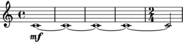

```haskell
stretch (4+1/2) c

```

</div>

TODO delay

Offset and duration is not limited to simple numbers. Here are some more complex examples:

<div class='haskell-music'>

<div class='haskell-music-listen'><a href='1edc473b107d869.mid'>[listen]</a></div>


```haskell
c|*(9/8) |> d|*(7/8)

```

</div>

<div class='haskell-music'>

<div class='haskell-music-listen'><a href='644e4aebee360312.mid'>[listen]</a></div>


```haskell
stretch (2/3) (scat [c,d,e]) |> f|*2

```

</div>

As you can see, note values, tuplets and ties are added automatically

The `|*` and `|/` operators can be used as shorthands for `delay` and `compress`.

<div class='haskell-music'>

<div class='haskell-music-listen'><a href='5fefb250ef328df8.mid'>[listen]</a></div>


```haskell
(c |> d |> e |> c |> d|*2 |> d|*2)|/16

```

</div>


Allthough the actual types are more general, you can think of `c` as an expression
of type `Score Note`, and the transformations as functions `Score Note -> Score Note`.

<div class='haskell-music'>

<div class='haskell-music-listen'><a href='c9352c6f488323b.mid'>[listen]</a></div>

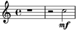

```haskell
up _P8 . compress 2 . delay 3 $ c

```

</div>


## Composition

Music expressions can be composed [`<>`][<>]:

<div class='haskell-music'>

<div class='haskell-music-listen'><a href='58ba103b1360ba6d.mid'>[listen]</a></div>


```haskell
c <> e <> g

```

</div>

TODO fundamentally, `<>` is the only way to compose music...

Or in sequence using [`|>`][|>]:

<div class='haskell-music'>

<div class='haskell-music-listen'><a href='7c428aa142b5aa58.mid'>[listen]</a></div>


```haskell
c |> d |> e

```

</div>

Or partwise using [`</>`][</>]:

<div class='haskell-music'>

<div class='haskell-music-listen'><a href='639edb196663a571.mid'>[listen]</a></div>

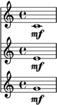

```haskell
c </> e </> g

```

</div>

Here is a more complex example:

<div class='haskell-music'>

<div class='haskell-music-listen'><a href='c135b8b327589e4.mid'>[listen]</a></div>

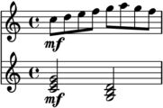

```haskell
let            
    scale = scat [c,d,e,f,g,a,g,f]|/8
    triad a = a <> up _M3 a <> up _P5 a
in up _P8 scale </> (triad c)|/2 |> (triad g_)|/2

```

</div>

As a shorthand for `x |> y |> z ..`, we can write [`scat`][scat] `[x, y, z]` (short for *sequential concatenation*).

<div class='haskell-music'>

<div class='haskell-music-listen'><a href='75387f0ecf07ed2f.mid'>[listen]</a></div>

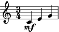

```haskell
scat [c,e..g]|/4

```

</div>

For `x <> y <> z ..`, we can write [`pcat`][pcat] `[x, y, z]` (short for *parallel concatenation*).

<div class='haskell-music'>

<div class='haskell-music-listen'><a href='6167bd1821e1d158.mid'>[listen]</a></div>


```haskell
pcat [c,e..g]|/2

```

</div>

Actually, [`scat`][scat] and [`pcat`][pcat] used to be called `melody` and `chord` back in the days, but
I figured out that these are names that you actually want to use in your own code.

## Pitch

### Pitch names

To facilitate the use of non-standard pitch, the standard pitch names are provided as overloaded values, referred to as *pitch literals*. 

To understand how this works, think about the type of numeric literal. The values $0, 1, 2$ etc. have type `Num a => a`, similarly, the pitch literals $c, d, e, f ...$ have type [`IsPitch`][IsPitch] `a => a`.

For Western-style pitch types, the standard pitch names can be used:

<div class='haskell-music'>

<div class='haskell-music-listen'><a href='17f047affc8ddd2b.mid'>[listen]</a></div>


```haskell
scat [c, d, e, f, g, a, b]

```

</div>

Pitch names in other languages work as well, for example `ut, do, re, mi, fa, so, la, ti, si`. 

<!--
German names (using `h` and `b` instead of `b` and `bb`) can be approximated as follows:

```haskell
import Music.Preludes hiding (b)
import qualified Music.Pitch.Literal as P

h = P.b
b = P.bb

```
-->


You can change octave using [`octavesUp`][octavesUp] and [`octavesDown`][octavesDown]:

<div class='haskell-music'>

<div class='haskell-music-listen'><a href='61074d8c25701bf5.mid'>[listen]</a></div>

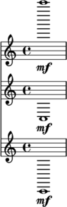

```haskell
octavesUp 4 c
    </>
octavesUp (-1) c
    </>
octavesDown 2 c

```

</div>

There is also a shorthand for other octaves:

<div class='haskell-music'>

<div class='haskell-music-listen'><a href='1109fefd3fa1dc47.mid'>[listen]</a></div>

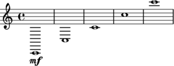

```haskell
c__ |> c_ |> c |> c' |> c''

```

</div>

Sharps and flats can be added by the functions [`sharp`][sharp] and [`flat`][flat], which are written 
*postfix* thanks to some overloading magic.

<div class='haskell-music'>

<div class='haskell-music-listen'><a href='22ce387a0ab4ff85.mid'>[listen]</a></div>


```haskell
c sharp |> d |> e flat

```

</div>

You can also use the ordinary (prefix) versions [`sharpen`][sharpen] and [`flatten`][flatten].

<div class='haskell-music'>

<div class='haskell-music-listen'><a href='49c22911c4f4e58f.mid'>[listen]</a></div>


```haskell
sharpen c 
    </> 
(sharpen . sharpen) c

```

</div>

As you might expect, there is also a shorthand for sharp and flat notes:

<div class='haskell-music'>

<div class='haskell-music-listen'><a href='2969b8f9ef50f5b9.mid'>[listen]</a></div>

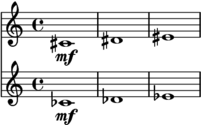

```haskell
(cs |> ds |> es)    -- sharp
    </>
(cb |> db |> eb)    -- flat

```

</div>

Here is an overview of all pitch notations:

```haskell
sharpen c             == c sharp       == cs
flatten d             == d flat        == db
(sharpen . sharpen) c == c doubleSharp == css
(flatten . flatten) d == d doubleFlat  == dss

```

Note that `cs == db` may or may not hold depending on which pitch representation you use.

### Interval names

Interval names are overloaded in a manner similar to pitches, and are consequently referred to as *interval literals*. The corresponding class is called [`IsInterval`][IsInterval].

Here and elsewhere in the Music Suite, the convention is to follow standard theoretical
notation, so *minor* and *diminished* intervals are written in lower-case, while *major*
and *perfect* intervals are written in upper-case. Unfortunately, Haskell does not support
overloaded upper-case values, so we have to adopt an underscore prefix:

```haskell
minor third      == m3
major third      == _M3
perfect fifth    == _P5
diminished fifth == d5
minor ninth      == m9

```

Similar to [`sharpen`][sharpen] and [`flatten`][flatten], the [`augment`][augment] and [`diminish`][diminish] functions can be used
to alter the size of an interval. For example:

<div class='haskell-music'>

<div class='haskell-music-listen'><a href='63d0ef62823cacd3.mid'>[listen]</a></div>


```haskell
let
    intervals = [diminish _P5, (diminish . diminish) _P5]
in scat $ fmap (`up` c) intervals

```

</div>

You can add pitches and intervals using the [`.-.`][.-.] and [`.+^`][.+^] operators. To memorize these
operators, think of pitches and points `.` and intervals as vectors `^`.


### Qualified pitch and interval names

There is nothing special about the pitch and interval literals, they are simply values exported by the `Music.Pitch.Literal` module. While this module is reexported by the standard music preludes, you can also import it qualified if you want to avoid bringing the single-letter pitch names into scope.

```haskell
Pitch.c |> Pitch.d .+^ Interval.m3

```

TODO overloading, explain why the following works:

```haskell
return (c::Note) == (c::Score Note)

```

## Dynamics

Dynamic values are overloaded in the same way as pitches. The dynamic literals are defined in `Music.Dynamics.Literal` and have type `IsDynamics a => a`.

[`level`][level]

An overview of the dynamic values:

<div class='haskell-music'>

<div class='haskell-music-listen'><a href='5d3b0f2055fae391.mid'>[listen]</a></div>


```haskell
scat $ zipWith level [fff,ff,_f,mf,mp,_p,pp,ppp] [c..]

```

</div>

TODO other ways of applying level

## Articulation

Some basic articulation functions are [`legato`][legato], [`staccato`][staccato], [`portato`][portato], [`tenuto`][tenuto], [`separated`][separated], [`staccatissimo`][staccatissimo]:

<div class='haskell-music'>

<div class='haskell-music-listen'><a href='6a7290123e0f1e7b.mid'>[listen]</a></div>


```haskell
legato (scat [c..g]|/8)
    </>
staccato (scat [c..g]|/8)
    </>
portato (scat [c..g]|/8)
    </>
tenuto (scat [c..g]|/8)
    </>
separated (scat [c..g]|/8)
    </>
staccatissimo (scat [c..g]|/8)

```

</div>

[`accent`][accent]
[`marcato`][marcato]

<div class='haskell-music'>

<div class='haskell-music-listen'><a href='1ec3a978b81083e2.mid'>[listen]</a></div>


```haskell
accent (scat [c..g]|/8)
    </>
marcato (scat [c..g]|/8)

```

</div>

[`accentLast`][accentLast]
[`accentAll`][accentAll]

<div class='haskell-music'>

<div class='haskell-music-listen'><a href='1003d657c7e41346.mid'>[listen]</a></div>

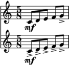

```haskell
accentLast (scat [c..g]|/8)
    </>
accentAll (scat [c..g]|/8)

```

</div>

Applying articulations over multiple parts:

<div class='haskell-music'>

<div class='haskell-music-listen'><a href='4e44c65bef76adc.mid'>[listen]</a></div>

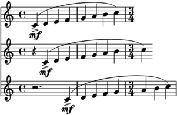

```haskell
let
    p1 = scat [c..c']|/4
    p2 = delay (1/4) $ scat [c..c']|/4
    p3 = delay (3/4) $ scat [c..c']|/4
in (accent . legato) (p1 </> p2 </> p3)

```

</div>

## Parts

[`Division`][Division]

[`Subpart`][Subpart]

[`Part`][Part]

[`Instrument`][Instrument]

[`Solo`][Solo]


## Space

TODO

## Tremolo

[`tremolo`][tremolo]

<div class='haskell-music'>

<div class='haskell-music-listen'><a href='39cef03e499affd9.mid'>[listen]</a></div>

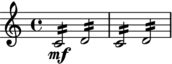

```haskell
tremolo 2 $ times 2 $ (c |> d)|/2

```

</div>

TODO chord tremolo

## Slides and glissando

[`slide`][slide]
[`glissando`][glissando]

<div class='haskell-music'>

<div class='haskell-music-listen'><a href='39ce49830d4547b3.mid'>[listen]</a></div>

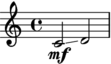

```haskell
glissando $ scat [c,d]|/2

```

</div>

## Harmonics

Use the [`harmonic`][harmonic] function:

<div class='haskell-music'>

<div class='haskell-music-listen'><a href='32148961e1f7cd18.mid'>[listen]</a></div>


```haskell
(harmonic 1 $ c|/2)
    </>
(harmonic 2 $ c|/2)
    </>
(harmonic 3 $ c|/2)

```

</div>

TODO artificial harmonics

[`artificial`][artificial]


## Text

TODO

[`text`][text]

<div class='haskell-music'>

<div class='haskell-music-listen'><a href='9705deac18f248e.mid'>[listen]</a></div>

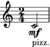

```haskell
text "pizz." $ c|/2

```

</div>

## Chords

Note with the same onset and offset are rendered as chords by default. If you want to prevent this you must put them in separate parts.

<div class='haskell-music'>

<div class='haskell-music-listen'><a href='62c9f5246f285cc8.mid'>[listen]</a></div>

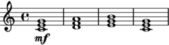

```haskell
scat [c,d,e,c] <> scat [e,f,g,e] <> scat [g,a,b,g]

```

</div>

Or, equivalently:

<div class='haskell-music'>

<div class='haskell-music-listen'><a href='6408e89ef3ea87d.mid'>[listen]</a></div>


```haskell
pcat [c,e,g] |> pcat [d,f,a] |> pcat [e,g,b] |> pcat [c,e,g]

```

</div>

TODO how part separation works w.r.t. division etc

[`simultaneous`][simultaneous]

[`simult`][simult]

## Rests

Similar to chords, there is usually no need to handle rests explicitly.

TODO add explicit rests etc

[`mcatMaybes`][mcatMaybes] 

<div class='haskell-music'>

<div class='haskell-music-listen'><a href='2d85632f9fbc29e6.mid'>[listen]</a></div>

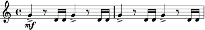

```haskell
mcatMaybes $ times 4 (accentAll g|*2 |> rest |> scat [d,d]|/2)|/8 

```

</div>
                 


<!--
# Transforming music

## Time transformations

[`rev`][rev]

<div class='haskell-music'>

<div class='haskell-music-listen'><a href='2ef7d21eb3d63550.mid'>[listen]</a></div>


```haskell
let
    melody = accent $ legato $ scat [d, scat [g,fs]|/2,bb|*2]|/4
in melody |> rev melody

```

</div>

[`times`][times]

<div class='haskell-music'>

<div class='haskell-music-listen'><a href='7d5b65e57f30ce41.mid'>[listen]</a></div>


```haskell
let
    melody = legato $ scat [c,d,e,c]|/16
in times 4 $ melody

```

</div>

[`sustain`][sustain]

<div class='haskell-music'>

<div class='haskell-music-listen'><a href='38249d5155da304c.mid'>[listen]</a></div>


```haskell
scat [e,d,f,e] <> c

```

</div>

## Onset and duration

```music+haskellx
let                
    melody = asScore $ legato $ scat [scat [c,d,e,c], scat [e,f], g|*2]
    pedal  = asScore $ delayTime (melody^.onset) $ stretch (melody^.duration) $ c_
in compress 4 $ melody </> pedal
```

## Pitch

[`invertPitches`][invertPitches]

<div class='haskell-music'>

<div class='haskell-music-listen'><a href='59471af4523858ff.mid'>[listen]</a></div>


```haskell
(scat [c..g]|*(2/5))
    </>
(invertPitches c $ scat [c..g]|*(2/5))
    </>
(invertPitches e $ scat [c..g]|*(2/5))

```

</div>


## Pitches and intervals

TODO

## Name and accidental

TODO

## Spelling

TODO

## Quality and number

TODO


## Intonation

TODO

## Inspecting dissonant intervals

TODO

## Semitones and enharmonic equivalence

TODO

## Spelling

TODO

## Scales

TODO

## Chords

TODO


## Parts

## Instrument, part and sub-part

## Extracting and modifying parts

## Part composition

-->

# Musical aspects

## Pitch

[`HasPitch`][HasPitch]

[`pitch`][pitch]

[`pitch'`][pitch']


[`HasPitches`][HasPitches]

[`pitches`][pitches]

[`pitches'`][pitches']

[`up`][up]

[`down`][down]

[`above`][above]

[`below`][below]


[`number`][number]
[`quality`][quality]
[`name`][name]
[`accidental`][accidental]
[`number`][number]
[`invert`][invert]
[`simple`][simple]
[`octaves`][octaves]
[`asPitch`][asPitch]
[`asAccidental`][asAccidental]

## Articulation
## Dynamics
## Parts
## Space


# Time and structure

[`Transformable`][Transformable]

[`Splittable`][Splittable]

[`Reversible`][Reversible]

[`HasPosition`][HasPosition]

[`HasDuration`][HasDuration]


## Time, duration and span

Time points and vectors are represented by two types [`Time`][Time] and [`Duration`][Duration]. The difference between these types is similar to the distinction between points and vectors in ordinary geometry. One way of thinking about time vs. duration is that duration are always *relative* (i.e. the duration between the start of two notes), while *time* is absolute.

Time points form an affine space over durations, so we can use the operators [`.+^`][.+^] and [`.-.`][.-.] to convert between the two.

The [`Span`][Span] type represents a *slice* of time. We can represent spans in exactly three ways: as two points representing *onset* and *offset*, as one point representing *onset* and a duration, or alternatively as a point representing *offset* and a duration. To convert between these representations, we can use [`range`][range], [`delta`][delta] and [`codelta`][codelta], which are *isomorphisms* using the definition from the `lens` package.

## Rests, Notes and Chords

[`Note`][Note]

## Voices

A [`Voice`][Voice] represents a single voice of music. It consists of a sequence of values with duration. 

<div class='haskell-music'>

<div class='haskell-music-listen'><a href='5116c32884c4447c.mid'>[listen]</a></div>

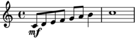

```haskell
stretch (1/4) $ scat [c..a]|/2 |> b |> c'|*4

```

</div>

<div class='haskell-music'>

<div class='haskell-music-listen'><a href='18242a3ca51b3278.mid'>[listen]</a></div>


```haskell
stretch (1/2) $ scat [c..e]|/3 |> f |> g|*2

```

</div>


It can be converted into a score by stretching each element and composing in sequence.

<!--
```music+haskellx
let
    x = [ (1, c),
          (1, d),
          (1, f),
          (1, e) ]^.voice

    y = join $ [ (1, x), 
                 (0.5, up _P5 x), 
                 (4, up _P8 x) ]^.voice

in stretch (1/8) $ voiceToScore $ y
```
-->

## Segment and Linear

## Behavior and Reactive

## Tracks

A [`Track`][Track] is similar to a score, except that it events have no offset or duration. It is useful for representing point-wise occurrences such as samples, cues or percussion notes.

It can be converted into a score by delaying each element and composing in parallel. An explicit duration has to be provided.

<!--
```music+haskellx
let
    x = [ (0, c), (1, d), (2, e) ]^.track
    y = join $ [ (0, x), 
                (1.5,  up _P5 x), 
                (3.25, up _P8 x) ]^.track

in trackToScore (1/8) y
```
-->

## Scores

[`Score`][Score]


# Meta-information

It is often desirable to annotate music with extraneous information, such as title, creator or, key or time signature. Also, it is often useful to mark scores with structural information such as movement numbers, rehearsal marks or general annotations. In the Music Suite these are grouped together under the common label *meta-information*.

The notion of meta-data used in the Music Suite is more extensive than just static values: any [`Transformable`][Transformable] container can be wrapped, and the meta-data will be transformed when the annotated value is transformed. This is why meta-data is often variable values, such as [`Reactive`][Reactive] or [`Behavior`][Behavior].

All time structures in the Suite support an arbitrary number of meta-data fields, indexed by type. All meta-information is required to satisfy the `Typeable`, so that meta-data can be packed and unpacked dynamically), and `Monoid`, so that values can be created and composed without having to worry about meta-data. The `mempty` value is implicitly chosen if no meta-information of the given type has been entered: for example the default title is empty, the default time signature is `4/4`. If two values annotated with meta-data are composed, their associated meta-data maps are composed as well, using the `<>` operator on each of the types.

The distinction between ordinary musical data and meta-data is not always clear cut. As a rule of thumb, meta-events are any kind of event that does not directly affect how the represented music sounds when performed. However they might affect the appearance of the musical notation. For example, a *clef* is meta-information, while a *slur* is not. A notable exception to this rule is meta-events affecting tempo such as metronome marks and fermatas, which usually *do* affect the performance of the music.

## Title

Title, subtitle etc is grouped together as a single type `Title`, thus an arbitrary number of nested titles is supported. The simplest way to add a title is to use the functions [`title`][title], [`subtitle`][subtitle], [`subsubtitle`][subsubtitle] and so son.

<div class='haskell-music'>

<div class='haskell-music-listen'><a href='36944bc61ca24134.mid'>[listen]</a></div>


```haskell
title "Frere Jaques" $ scat [c,d,e,c]|/4

```

</div>

## Attribution

Similar to titles, the attribution of the creators of music can be annotated according to description such as [`composer`][composer], [`lyricist`][lyricist], [`arranger`][arranger] etc. More generally, [`attribution`][attribution] or [`attributions`][attributions] can be used to embed arbitrary `(profession, name)` mappings.

<div class='haskell-music'>

<div class='haskell-music-listen'><a href='5779fddc95fb274d.mid'>[listen]</a></div>

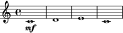

```haskell
composer "Anonymous" $ scat [c,d,e,c]

```

</div>

<div class='haskell-music'>

<div class='haskell-music-listen'><a href='1ec9903705dbdaea.mid'>[listen]</a></div>


```haskell
composer "Anonymous" $ lyricist "Anonymous" $ arranger "Hans" $ scat [c,d,e,c]|/4

```

</div>

## Key signatures

[`key`][key]

[`keySignature`][keySignature]

[`keySignatureDuring`][keySignatureDuring]

[`withKeySignature`][withKeySignature]

## Time signatures          

[`time`][time]

[`compoundTime`][compoundTime]

[`timeSignature`][timeSignature]

[`timeSignatureDuring`][timeSignatureDuring]

[`withTimeSignature`][withTimeSignature]

## Tempo

[`metronome`][metronome]

[`tempo`][tempo]

[`tempoDuring`][tempoDuring]

[`renderTempo`][renderTempo]

## Fermatas, caesuras and breathing marks

TODO

## Ritardando and accellerando

TODO

## Rehearsal marks

TODO

[`rehearsalMark`][rehearsalMark]

[`rehearsalMarkDuring`][rehearsalMarkDuring]

[`withRehearsalMark`][withRehearsalMark]

## Barlines and repeats

There is generally no need to enter bars explicitly, as this information can be inferred from other meta-information. Generally, the following meta-events (in any part), will force a change of bar:

* Key signature changes
* Time signature changes
* Tempo changes
* Rehearsal marks

However, the user may also enter explicit bar lines using the following functions:

[`barline`][barline]

[`doubleBarline`][doubleBarline]

[`finalBarline`][finalBarline]

Whenever a bar line is created as a result of a meta-event, an shorted time signature may need to be inserted as in:

<div class='haskell-music'>

<div class='haskell-music-listen'><a href='11121d609d357e22.mid'>[listen]</a></div>


```haskell
compress 4 $ timeSignature (4/4) (scat [c,d,e,c,d,e,f,d,g,d]) |> timeSignature (3/4) (scat [a,g,f,g,f,e])

```

</div>

TODO adapt getBarDurations and getBarTimeSignatures to actually do this

TODO repeats

## Clefs

To set the clef for a whole passage, use [`clef`][clef]. The clef is used by most notation backends and ignored by audio backends.

To set the clef for a preexisting passage in an existing score, use [`clefDuring`][clefDuring].

TODO example

## Annotations

Annotations are simply textual values attached to a specific section of the score. In contrast to other types of meta-information annotations always apply to the whole score, not to a single part. To annotate a score use [`annotate`][annotate], to annotate a specific span, use [`annotateSpan`][annotateSpan].

Annotations are invisible by default. To show annotations in the generated output, use
[`showAnnotations`][showAnnotations].

<div class='haskell-music'>

<div class='haskell-music-listen'><a href='10bdd160155b65f4.mid'>[listen]</a></div>

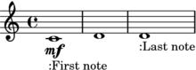

```haskell
showAnnotations $ annotate "First note" c |> d |> annotate "Last note" d

```

</div>

## Custom meta-information

Meta-information is not restricted to the types described above. In fact, the user can add meta-information of any type that satisfies the [`AttributeClass`][AttributeClass] constraint, including user-defined types. Meta-information is required to implement `Monoid`. The `mempty` value is used as a default value for the type, while the `mappend` function is used to combine the default value and all values added by the user.

Typically, you want to use a monoid similar to `Maybe`, `First` or `Last`, but not one derived from the list type. The reason for this is that meta-scores compose, so that `getMeta (x <> y) = getMeta x <> getMeta y`.

<!--
TODO unexpected results with filter and recompose, solve by using a good Monoid
Acceptable Monoids are Maybe and Set/Map, but not lists (ordered sets/unique lists OK)
See issue 103
-->

[`HasMeta`][HasMeta]

[`setMetaAttr`][setMetaAttr]

[`setMetaTAttr`][setMetaTAttr]


# Import and export

The standard distribution (installed as part of `music-suite`) of the Music Suite includes a variety of input and output formats. There are also some experimental formats, which are distributed in separate packages, these are marked as experimental below.

The conventions for input or output formats is similar to the convention for properties (TODO ref above): for any type `a` and format `T a`, input formats are defined by an *is* constraint, and output format by a *has* constraint. For example, types that can be exported to Lilypond are defined by the constraint `HasLilypond a`, while types that can be imported from MIDI are defined by the constraint `IsMidi a`.

## MIDI

All standard representations support MIDI input and output. The MIDI representation uses [HCodecs](http://hackage.haskell.org/package/HCodecs) and the real-time support uses [hamid](http://hackage.haskell.org/package/hamid). 

<!--
You can read and write MIDI files using the functions [`readMidi`][readMidi] and [`writeMidi`][writeMidi]. To play MIDI back in real-time, use [`playMidi`][playMidi] or [`playMidiIO`][playMidiIO], which uses [reenact](http://hackage.haskell.org/package/reenact).
-->

Beware that MIDI input may contain time and pitch values that yield a non-readable notation, you need an sophisticated piece of analysis software to convert raw MIDI input to quantized input.

## Lilypond

All standard representations support Lilypond output. The [lilypond](http://hackage.haskell.org/package/lilypond) package is used for parsing and pretty printing of Lilypond syntax. Lilypond is the recommended way of rendering music notation.

Lilypond input is not available yet but a subset of the Lilypond language will hopefully be added soon.

An example:

```haskell
toLilypondString $ asScore $ scat [c,d,e]

```

    <<
        \new Staff { <c'>1 <d'>1 <e'>1 }
    >>


## MusicXML

All standard representations support MusicXML output. The [musicxml2](http://hackage.haskell.org/package/musicxml2) package is used for 
parsing and pretty printing. 

The output is fairly complete, with some limitations ([reports][issue-tracker] welcome). There are no plans to support input in the near future.

Beware of the extreme verboseness of XML, for example:

```haskell
toMusicXmlString $ asScore $ scat [c,d,e]

```

    <?xml version='1.0' ?>
    <score-partwise>
      <movement-title>Title</movement-title>
      <identification>
        <creator type="composer">Composer</creator>
      </identification>
      <part-list>
        <score-part id="P1">
          <part-name></part-name>
        </score-part>
      </part-list>
      <part id="P1">
        <measure number="1">
          <attributes>
            <key>
              <fifths>0</fifths>
              <mode>major</mode>
            </key>
          </attributes>
          <attributes>
            <divisions>768</divisions>
          </attributes>
          <direction>
            <direction-type>
              <metronome>
                <beat-unit>quarter</beat-unit>
                <per-minute>60</per-minute>
              </metronome>
            </direction-type>
          </direction>
          <attributes>
            <time symbol="common">
              <beats>4</beats>
              <beat-type>4</beat-type>
            </time>
          </attributes>
          <note>
            <pitch>
              <step>C</step>
              <alter>0.0</alter>
              <octave>4</octave>
            </pitch>
            <duration>3072</duration>
            <voice>1</voice>
            <type>whole</type>
          </note>
        </measure>
        <measure number="2">
          <note>
            <pitch>
              <step>D</step>
              <alter>0.0</alter>
              <octave>4</octave>
            </pitch>
            <duration>3072</duration>
            <voice>1</voice>
            <type>whole</type>
          </note>
        </measure>
        <measure number="3">
          <note>
            <pitch>
              <step>E</step>
              <alter>0.0</alter>
              <octave>4</octave>
            </pitch>
            <duration>3072</duration>
            <voice>1</voice>
            <type>whole</type>
          </note>
        </measure>
      </part>
    </score-partwise>
    

## ABC Notation

ABC notation (for use with [abcjs](https://github.com/paulrosen/abcjs) or similar engines) is still experimental.

## Guido

Guido output (for use with the [GUIDO engine](http://guidolib.sourceforge.net/)) is not supported yet. This would be useful, as it allow real-time rendering of scores.

## Vextab

Vextab output (for use with [Vexflow](http://www.vexflow.com/)) is not supported yet.

## Sibelius

The [music-sibelius](http://hackage.haskell.org/package/music-sibelius) package provides experimental import of Sibelius scores (as MusicXML import is [not supported](#musicxml)).

<!--
This feature could of course also be used to convert Sibelius scores to other formats such as Guido or ABC without having to write in the ManuScript language used by Sibelius.
-->


# Customizing music representation

## Adding an new representation

You can use your own representation for all standard musical aspects.

TODO

## Adding a new aspect

It is also possible to make the Suite work with completely *new* aspects.

TODO

## Adding a time structure

TODO

- Create a type of kind `* -> *`.
- Add instances for the standard classes [`Functor`][Functor], [`Applicative`][Applicative] and (if possible) [`Monad`][Monad] or [`Comonad`][Comonad].
- If your representation supports *parallel* composition it should be a trivial (non-lifted) [`Monoid`][Monoid]. It it also supports sequential composition, it should support [`Transformable`][Transformable] and [`HasPosition`][HasPosition].
- Optionally, add instances for [`Splittable`][Splittable] and [`Reversible`][Reversible].


# Acknowledgements

The Music Suite is indebted to many other previous libraries and computer music environments, particularly [Common Music][common-music], [PWGL][pwgl], [Max/MSP][max-msp], [SuperCollider][supercollider], [nyquist][nyquist], [music21][music21], [Guido][guido], [Lilypond][lilypond] and [Abjad][abjad]. Some of the ideas for the quantization algorithms came from [Fomus][fomus].

The Music Suite obviously ows much to the previous Haskell libraries for music representation, including [Haskore][haskore], [Euterpea][euterpea] and [temporal-media][temporal-media]. The idea of defining a custom internal representation, but relying on standardized formats for input and output comes from [Pandoc][pandoc]. The idea of splitting the library into a set of packages (and the name) comes from the [Haskell Suite][haskell-suite].

The temporal structures, their instances and the concept of denotational design comes from [Reactive][reactive] (and its predecessors). [Diagrams][diagrams] provided the daring example and some general influences on the design.


<script src="js/jasmid/stream.js"></script>
<script src="js/jasmid/midifile.js"></script>
<script src="js/jasmid/replayer.js"></script>
<script src="js/midi.js"></script>
<script src="js/Base64.js" type="text/javascript"></script>
<script src="js/base64binary.js" type="text/javascript"></script>
<script src="js/main.js" type="text/javascript"></script>


[.+^]: /docs/api/music-pitch/Music-Pitch.html#v:-46--43--94-
[.-.]: /docs/api/music-pitch/Music-Pitch.html#v:-46--45--46-
[</>]: /docs/api/music-score/Music-Score-Part.html#v:-60--47--62-
[<>]: /docs/api/music-pitch/Music-Pitch.html#v:-60--62-
[Applicative]: /docs/api/music-score/Music-Score.html#t:Applicative
[AttributeClass]: /docs/api/music-score/Music-Score-Meta.html#t:AttributeClass
[Behavior]: /docs/api/music-score/Music-Time-Behavior.html#t:Behavior
[Comonad]: 
<!-- Unknown: Comonad No such identifier: Comonad-->

[Division]: /docs/api/music-parts/Music-Parts-Division.html#t:Division
[Duration]: /docs/api/music-score/Music-Time-Internal-Transform.html#t:Duration
[Functor]: /docs/api/music-score/Music-Score.html#t:Functor
[HasDuration]: /docs/api/music-score/Music-Time-Duration.html#t:HasDuration
[HasMeta]: /docs/api/music-score/Music-Score-Meta.html#t:HasMeta
[HasPitch]: /docs/api/music-score/Music-Score-Pitch.html#t:HasPitch
[HasPitches]: /docs/api/music-score/Music-Score-Pitch.html#t:HasPitches
[HasPosition]: /docs/api/music-score/Music-Time-Juxtapose.html#t:HasPosition
[Instrument]: /docs/api/music-parts/Music-Parts-Instrument.html#t:Instrument
[IsInterval]: /docs/api/music-pitch-literal/Music-Pitch-Literal-Interval.html#t:IsInterval
[IsPitch]: /docs/api/music-pitch-literal/Music-Pitch-Literal-Pitch.html#t:IsPitch
[Monad]: /docs/api/music-score/Music-Score.html#t:Monad
[Monoid]: /docs/api/music-pitch/Music-Pitch.html#t:Monoid
[Note]: /docs/api/music-score/Music-Time-Note.html#t:Note
[Part]: /docs/api/music-score/Music-Score-Part.html#t:Part
[Reactive]: /docs/api/music-score/Music-Time-Reactive.html#t:Reactive
[Reversible]: /docs/api/music-score/Music-Time-Juxtapose.html#t:Reversible
[Score]: /docs/api/music-score/Music-Time-Score.html#t:Score
[Solo]: /docs/api/music-parts/Music-Parts-Solo.html#t:Solo
[Span]: /docs/api/music-score/Music-Time-Internal-Transform.html#t:Span
[Splittable]: /docs/api/music-score/Music-Time-Juxtapose.html#t:Splittable
[Subpart]: /docs/api/music-parts/Music-Parts-Subpart.html#t:Subpart
[Time]: /docs/api/music-score/Music-Time-Internal-Transform.html#t:Time
[Track]: /docs/api/music-score/Music-Time-Track.html#t:Track
[Transformable]: /docs/api/music-score/Music-Time-Internal-Transform.html#t:Transformable
[Voice]: /docs/api/music-score/Music-Time-Voice.html#t:Voice
[above]: /docs/api/music-score/Music-Score-Pitch.html#v:above
[accentAll]: /docs/api/music-score/Music-Score-Articulation.html#v:accentAll
[accentLast]: /docs/api/music-score/Music-Score-Articulation.html#v:accentLast
[accent]: /docs/api/music-score/Music-Score-Articulation.html#v:accent
[accidental]: /docs/api/music-pitch/Music-Pitch-Common-Pitch.html#v:accidental
[annotateSpan]: /docs/api/music-score/Music-Score-Meta-Annotations.html#v:annotateSpan
[annotate]: /docs/api/music-score/Music-Score-Meta-Annotations.html#v:annotate
[arranger]: /docs/api/music-score/Music-Score-Meta-Attribution.html#v:arranger
[artificial]: /docs/api/music-score/Music-Score-Harmonics.html#v:artificial
[asAccidental]: 
<!-- Unknown: asAccidental No such identifier: asAccidental-->

[asPitch]: 
<!-- Unknown: asPitch No such identifier: asPitch-->

[attribution]: /docs/api/music-score/Music-Score-Meta-Attribution.html#v:attribution
[attributions]: /docs/api/music-score/Music-Score-Meta-Attribution.html#v:attributions
[augment]: /docs/api/music-pitch-literal/Music-Pitch-Augmentable.html#v:augment
[barline]: /docs/api/music-score/Music-Score-Meta-Barline.html#v:barline
[below]: /docs/api/music-score/Music-Score-Pitch.html#v:below
[clefDuring]: /docs/api/music-score/Music-Score-Meta-Clef.html#v:clefDuring
[clef]: /docs/api/music-score/Music-Score-Meta-Clef.html#v:clef
[codelta]: /docs/api/music-score/Music-Time-Internal-Transform.html#v:codelta
[composer]: /docs/api/music-score/Music-Score-Meta-Attribution.html#v:composer
[compoundTime]: /docs/api/music-score/Music-Score-Meta-Time.html#v:compoundTime
[compress]: /docs/api/music-score/Music-Time-Internal-Transform.html#v:compress
[delta]: /docs/api/music-score/Music-Time-Internal-Transform.html#v:delta
[diminish]: /docs/api/music-pitch-literal/Music-Pitch-Augmentable.html#v:diminish
[doubleBarline]: /docs/api/music-score/Music-Score-Meta-Barline.html#v:doubleBarline
[down]: /docs/api/music-score/Music-Score-Pitch.html#v:down
[finalBarline]: /docs/api/music-score/Music-Score-Meta-Barline.html#v:finalBarline
[flat]: /docs/api/music-pitch/Music-Pitch-Common-Pitch.html#v:flat
[flatten]: /docs/api/music-pitch-literal/Music-Pitch-Alterable.html#v:flatten
[glissando]: /docs/api/music-score/Music-Score-Slide.html#v:glissando
[harmonic]: /docs/api/music-score/Music-Score-Harmonics.html#v:harmonic
[invertPitches]: /docs/api/music-score/Music-Score-Pitch.html#v:invertPitches
[invert]: /docs/api/music-pitch/Music-Pitch-Common-Interval.html#v:invert
[keySignatureDuring]: /docs/api/music-score/Music-Score-Meta-Key.html#v:keySignatureDuring
[keySignature]: /docs/api/music-score/Music-Score-Meta-Key.html#v:keySignature
[key]: /docs/api/music-score/Music-Score-Meta-Key.html#v:key
[legato]: /docs/api/music-score/Music-Score-Articulation.html#v:legato
[level]: /docs/api/music-score/Music-Score-Dynamics.html#v:level
[lyricist]: /docs/api/music-score/Music-Score-Meta-Attribution.html#v:lyricist
[marcato]: /docs/api/music-score/Music-Score-Articulation.html#v:marcato
[mcatMaybes]: /docs/api/music-score/Music-Score.html#v:mcatMaybes
[metronome]: /docs/api/music-score/Music-Score-Meta-Tempo.html#v:metronome
[name]: /docs/api/music-pitch/Music-Pitch-Common-Pitch.html#v:name
[number]: /docs/api/music-pitch/Music-Pitch-Common-Number.html#v:number
[octavesDown]: /docs/api/music-score/Music-Score-Pitch.html#v:octavesDown
[octavesUp]: /docs/api/music-score/Music-Score-Pitch.html#v:octavesUp
[octaves]: /docs/api/music-pitch/Music-Pitch-Common-Interval.html#v:octaves
[pcat]: /docs/api/music-score/Music-Time-Juxtapose.html#v:pcat
[pitch']: /docs/api/music-score/Music-Score-Pitch.html#v:pitch'
[pitch]: /docs/api/music-score/Music-Score-Pitch.html#v:pitch
[pitches']: /docs/api/music-score/Music-Score-Pitch.html#v:pitches'
[pitches]: /docs/api/music-score/Music-Score-Pitch.html#v:pitches
[playMidiIO]: 
<!-- Unknown: playMidiIO No such identifier: playMidiIO-->

[playMidi]: 
<!-- Unknown: playMidi No such identifier: playMidi-->

[portato]: /docs/api/music-score/Music-Score-Articulation.html#v:portato
[quality]: /docs/api/music-pitch/Music-Pitch-Common-Quality.html#v:quality
[range]: /docs/api/music-score/Music-Time-Internal-Transform.html#v:range
[readMidi]: /docs/api/music-score/Music-Score-Import-Midi.html#v:readMidi
[rehearsalMarkDuring]: /docs/api/music-score/Music-Score-Meta-RehearsalMark.html#v:rehearsalMarkDuring
[rehearsalMark]: /docs/api/music-score/Music-Score-Meta-RehearsalMark.html#v:rehearsalMark
[renderTempo]: /docs/api/music-score/Music-Score-Meta-Tempo.html#v:renderTempo
[rev]: /docs/api/music-score/Music-Time-Juxtapose.html#v:rev
[scat]: /docs/api/music-score/Music-Time-Juxtapose.html#v:scat
[separated]: /docs/api/music-score/Music-Score-Articulation.html#v:separated
[setMetaAttr]: /docs/api/music-score/Music-Score-Meta.html#v:setMetaAttr
[setMetaTAttr]: /docs/api/music-score/Music-Score-Meta.html#v:setMetaTAttr
[sharp]: /docs/api/music-pitch/Music-Pitch-Common-Pitch.html#v:sharp
[sharpen]: /docs/api/music-pitch-literal/Music-Pitch-Alterable.html#v:sharpen
[showAnnotations]: /docs/api/music-score/Music-Score-Meta-Annotations.html#v:showAnnotations
[simple]: /docs/api/music-pitch/Music-Pitch-Common-Interval.html#v:simple
[simult]: 
<!-- Unknown: simult No such identifier: simult-->

[simultaneous]: /docs/api/music-score/Music-Time-Score.html#v:simultaneous
[slide]: /docs/api/music-score/Music-Score-Slide.html#v:slide
[staccatissimo]: /docs/api/music-score/Music-Score-Articulation.html#v:staccatissimo
[staccato]: /docs/api/music-score/Music-Score-Articulation.html#v:staccato
[stretch]: /docs/api/music-score/Music-Time-Internal-Transform.html#v:stretch
[subsubtitle]: /docs/api/music-score/Music-Score-Meta-Title.html#v:subsubtitle
[subtitle]: /docs/api/music-score/Music-Score-Meta-Title.html#v:subtitle
[sustain]: /docs/api/music-score/Music-Time-Juxtapose.html#v:sustain
[tempoDuring]: /docs/api/music-score/Music-Score-Meta-Tempo.html#v:tempoDuring
[tempo]: /docs/api/music-score/Music-Score-Meta-Tempo.html#v:tempo
[tenuto]: /docs/api/music-score/Music-Score-Articulation.html#v:tenuto
[text]: /docs/api/music-score/Music-Score-Text.html#v:text
[timeSignatureDuring]: /docs/api/music-score/Music-Score-Meta-Time.html#v:timeSignatureDuring
[timeSignature]: /docs/api/music-score/Music-Score-Meta-Time.html#v:timeSignature
[time]: /docs/api/music-score/Music-Score-Meta-Time.html#v:time
[times]: /docs/api/music-score/Music-Time-Juxtapose.html#v:times
[title]: /docs/api/music-score/Music-Score-Meta-Title.html#v:title
[tremolo]: /docs/api/music-score/Music-Score-Tremolo.html#v:tremolo
[up]: /docs/api/music-score/Music-Score-Pitch.html#v:up
[withKeySignature]: /docs/api/music-score/Music-Score-Meta-Key.html#v:withKeySignature
[withRehearsalMark]: /docs/api/music-score/Music-Score-Meta-RehearsalMark.html#v:withRehearsalMark
[withTimeSignature]: /docs/api/music-score/Music-Score-Meta-Time.html#v:withTimeSignature
[writeMidi]: /docs/api/music-score/Music-Score-Export-Midi.html#v:writeMidi
[|>]: /docs/api/music-score/Music-Time-Juxtapose.html#v:-124--62-

[lilypond]:         http://lilypond.org
[timidity]:         http://timidity.sourceforge.net/
[haskell-platform]: http://www.haskell.org/platform/

[issue-tracker]:    https://github.com/hanshoglund/music-score/issues

[pwgl]:             http://www2.siba.fi/PWGL/
[pandoc]:           http://johnmacfarlane.net/pandoc/
[haskell-suite]:    https://github.com/haskell-suite
[music-util-docs]:  https://github.com/hanshoglund/music-util/blob/master/README.md#music-util

[common-music]:     http://commonmusic.sourceforge.net/
[temporal-media]:   http://hackage.haskell.org/package/temporal-media
[abjad]:            https://pypi.python.org/pypi/Abjad/2.3
[max-msp]:          http://cycling74.com/products/max/
[nyquist]:          http://audacity.sourceforge.net/help/nyquist
[reactive]:         http://www.haskell.org/haskellwiki/Reactive
[diagrams]:         http://projects.haskell.org/diagrams/
[supercollider]:    http://supercollider.sourceforge.net/
[music21]:          http://music21-mit.blogspot.se/
[guido]:            http://guidolib.sourceforge.net/
[lilypond]:         http://lilypond.org/
[fomus]:            http://fomus.sourceforge.net/
[haskore]:          http://www.haskell.org/haskellwiki/Haskore
[euterpea]:         http://haskell.cs.yale.edu/euterpea/
[haskell]:          http://haskell.org
[pandoc]:           http://johnmacfarlane.net/pandoc/

[declaration-style]: http://www.haskell.org/haskellwiki/Declaration_vs._expression_style

----

*Copyright Hans Jacob Höglund 2012–2013*

<a rel="license" href="http://creativecommons.org/licenses/by-nc-sa/4.0/"></a><br />This documentation is licensed under a <a rel="license" href="http://creativecommons.org/licenses/by-nc-sa/4.0/">Creative Commons Attribution-NonCommercial-ShareAlike 4.0 International License</a>.


